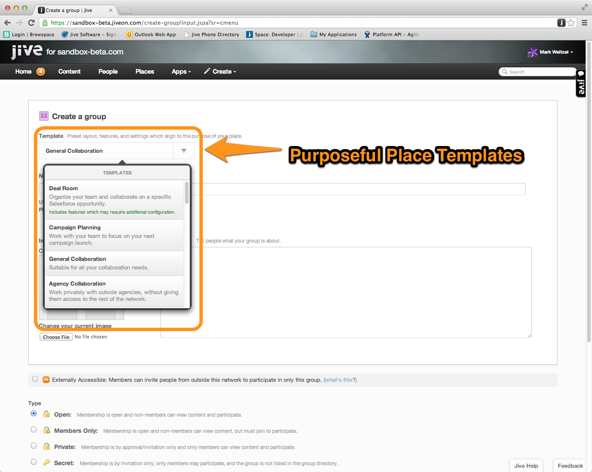
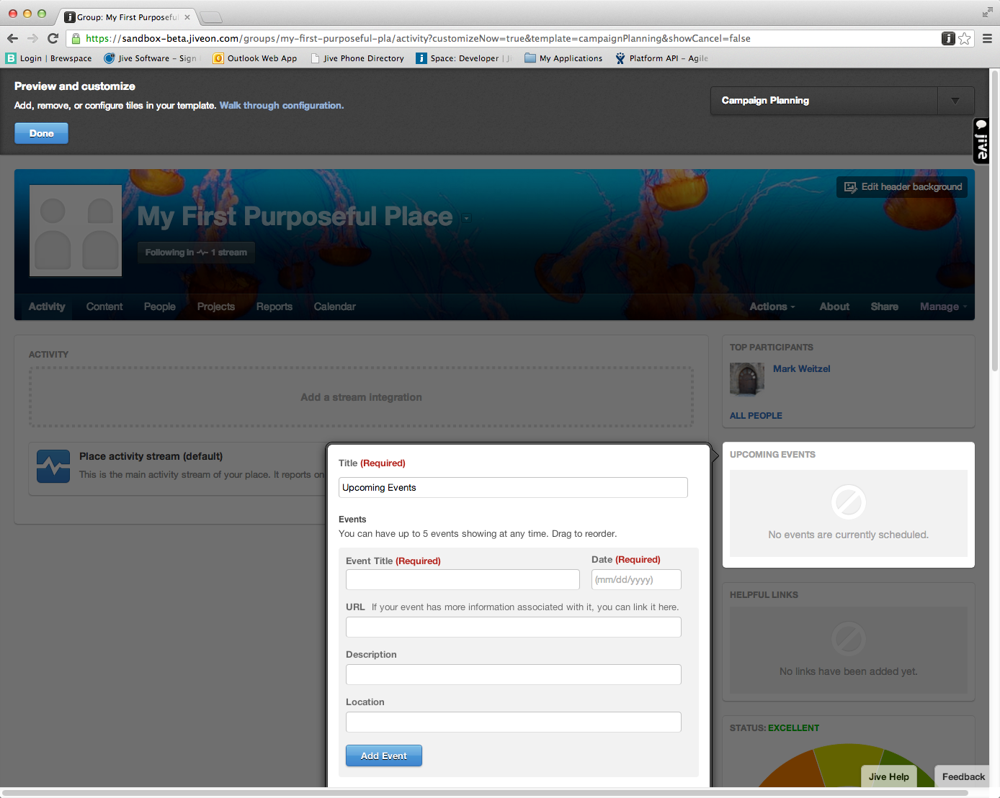
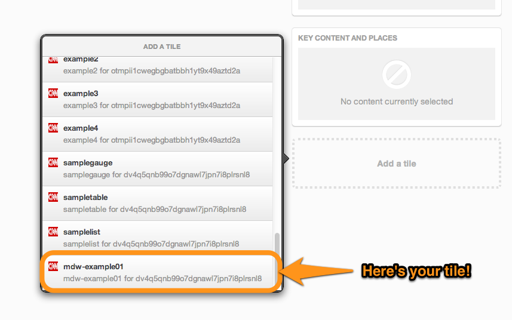
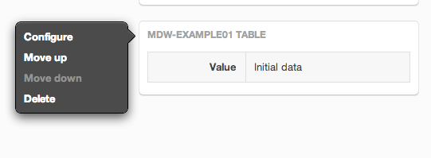
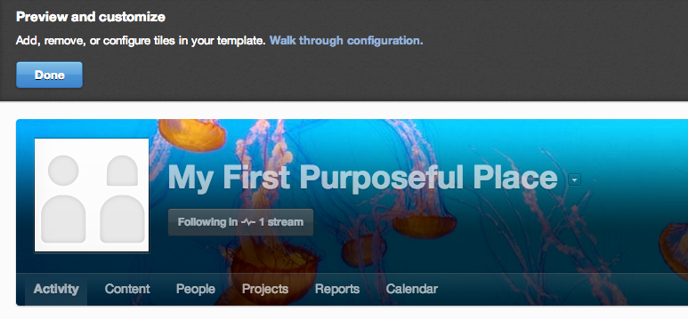

# Jive Purposeful Places Framework
 Purposeful Places are a brand new integration framework for Jive that allows you to quickly and easily external activity streams and content from virtually any system. Here's [a high level overview of Purposeful Places](./docs/overview.md). If you'd like to skip ahead, then jump right to the [Master Reference Doc](./docs/masterreferencedoc.md). Please make sure to post your feedback and comments in the [Jive Developer Community](https://community.jivesoftware.com/community/developer).

 This repository contains the node.js library to help you get started building purposeful places!

## Let's get started
Make sure you have [node.js](http://nodejs.org) installed. We're going to assume that you are at least a bit familiar with node.js and that you understand the basics, e.g. installing packages. We're also going to assume that you understand the basics of Purposeful Places and are familiar with the concepts of tiles and stream integrations.

The steps below will generate out a sample application that you can use as the building block for your integrations. Before you run this make sure to change to an empty directory. 

**Step 1. Install the jive-sdk**

`npm install jive-sdk -g`

**Step 2. Create an example**

`jive-sdk create table --name=MyFirstTile`

**Step 3. Install the node dependencies**

`npm install`

**Step 4. Make it your own**

The generated example needs to be configured with your own information, specifically, your credentials, and where you want the server to start. The configuration is in a very simple json file named jiveclientconfiguration.json. Here's what gets generated out of the box.

`{ "clientUrl": "http://localhost",
    "port": "8090",
    "clientId": "!!!_CHANGE_ME_DO_NOT_START_SERVER_WITH_OUT_A_REAL_ONE_FROM_JIVE!!!",
    "clientSecret": "!!!_CHANGE_ME_DO_NOT_START_SERVER_WITH_OUT_A_REAL_ONE_FROM_JIVE!!!"}`

What you should do is fill in the proper values for your server & port. The clientId and clientSecret are the credentials that you received when you registered with Jive as developer. (Note: We'll cover how to register with Jive later.)

**Step 5. Run the puppy!**

`node jive_app.js`

That's it! You have just created your first tile! If you'd like to see the tile definition, then you can enter the following URL in your browser. Of course, the server and port should match what you put in the configuration file.

`http://<servername><port>/tiles`

## Seeing your tiles in action
Now that your killer integration application is up and running, let's see your tiles in action. 

**Installing your tiles**
> {"handWaving" : "In order to install a tile, you must have admin privileges in the Jive instance. We are in the process of building out a utility that will do this for you in the sandbox. Stay tuned for details!"}

**Add your tiles to a Purposeful Place**
Using your tile in Purposeful Place is easy! All you need to do is create a group that uses a template. When you configure the group, you'll be able to add your tile! 

**Step 1: Create a Group**
For the most part, this is the same as creating a "regular" group in Jive, however, you now have the ability to apply a template.

You can choose any of the templates that are shipped with Jive, e.g. "Campaign Planning". Click the "Create" button to go to the next step.

**Step 2: Configure the Purposeful Place
When a new Purposeful Place is created, Jive brings you into the configuration view. Each template comes with a with a set of pre-installed tiles. The first step is to configure these tiles and add any others that you want.

**Step 3: Add your tile**
You can click away from the tile's configuration to be returned to the Purposeful Place. Now, scroll down until you see an option to "Add a Tile". Click on that link to bring up the list of tiles. You can scroll down the list until you find the tile you just created.

**Step 4: Configure your tile**
You'll want to configure the tile you just added. This is done by clicking on the tile, which will bring up the context menu. Select the "Configure" option. When you do, the dialog box opens that allows you to configure the tile. This is a very straightforward but powerful process. In fact, tile configuration can even handle 3-Legged OAuth!

**Step 5: You're Done!**
Click "Done" in the top left corner. That's it!! You've now successfully created a tile and added it to a Purposeful Place. For some of the tile types, the jive-sdk will automatically kick off an update process so you will see the changes as soon as they happen! 

## Learn More - Do More
We will be adding more capability to the jive-sdk along with a ton of examples to get you started! You should check out the [Master Reference Document](./docs/masterreferencedoc.md) for a complete list of material to get you started. 

**Enjoy!**

# License 

   Copyright 2013 Jive Software

   Licensed under the Apache License, Version 2.0 (the "License");
   you may not use this file except in compliance with the License.
   You may obtain a copy of the License at

      http://www.apache.org/licenses/LICENSE-2.0

   Unless required by applicable law or agreed to in writing, software
   distributed under the License is distributed on an "AS IS" BASIS,
   WITHOUT WARRANTIES OR CONDITIONS OF ANY KIND, either express or implied.
   See the License for the specific language governing permissions and
   limitations under the License.