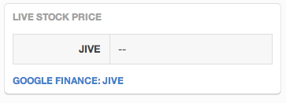
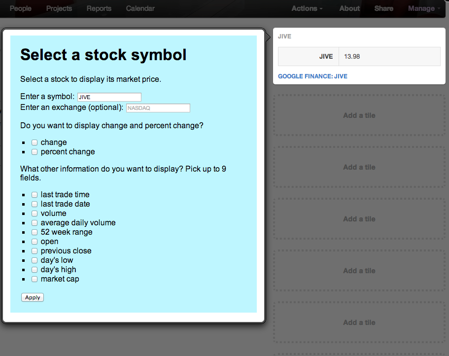

# Introduction to Tiles
Tiles are a new concept introduced that enable you can quickly and easily create powerful integrations with the Jive platform. Under the covers, Tiles build on the same powerful component model used by Jive Apps. However, Jive has simplified what it takes to actually create a tile by allowing the user to focus only on creating the proper views that will be used by the application. Besides a radical simplification of the overall programming model, as a developer, you have full access to the Jive Core, and the supported parts of the OpenSocial API.

At a high level, you can think of a tile as having four parts:

1. A Visual style
2. Data
3. An Action
4. A Configuration

### Visual Style
The visual style of a tile is how it is rendered in the Jive user interface. Jive provides a pre-defined set of visual styles that can be used by the developer to render data that is provided from a back end system. Examples include table, list, calendar, and gauge.

### Data
The tile data is the information that is displayed to the user. It is provided to Jive in the form of JSON, and is rendered using a given Visual Style. Here is the definition of the stock-price example. 

	{
	    "sampleData" : {
	        "title" : "Stock Price Example",
	        "contents" : [
	            { "name" : "JIVE", "value" : "--" }
	        ],
	        "action" : {
	            "text" : "Google Finance: JIVE",
	            "url" : "https://www.google.com/finance?q=JIVE"
	        }
	    },
	    "displayName" : "Stock Price (example-stock-tile)",
	    "name" : "example-stock-tile",
	    "description" : "Displays live stock prices",
	    "style" : "TABLE",
	    "icons" : {
	        "16"  : "http://openiconlibrary.sourceforge.net/gallery2/open_icon_library-full/icons/png/16x16/emblems/emblem-money.png",
	        "48"  : "http://openiconlibrary.sourceforge.net/gallery2/open_icon_library-full/icons/png/48x48/emblems/emblem-money.png",
	        "128" : "http://openiconlibrary.sourceforge.net/gallery2/open_icon_library-full/icons/png/128x128/emblems/emblem-money.png"
	    }
	}
	
When this definition is installed into Jive, it will render, by default, the following:

### Action 
One of the most exciting aspects of a tile is that it can cary along with it an action. Most tiles will be used to pull information from a backend system of record. Actions are a way for the user to interact with the back end system that is providing the data to the tile. Actions can either provide a link to an external Web page, or it can invoke an embedded experience and present the user with a dialog box. When using an embedded experience, as a developer, you will have full access to the Jive core javascript API and can make REST calls using AJAX via the osapi.http.get. 

### Configuration
In order to present the proper data to a user a tile will need to be configured. This is a custom view that is provided by the developer and invoked when the configure menu option is selected from the tile's context menu. Here's a screen capture from the stock price example:

#Summary
Tiles are a new kind of integration that open unlimited integration possibilities. They are lightweight, flexible, and extremely powerful. 
