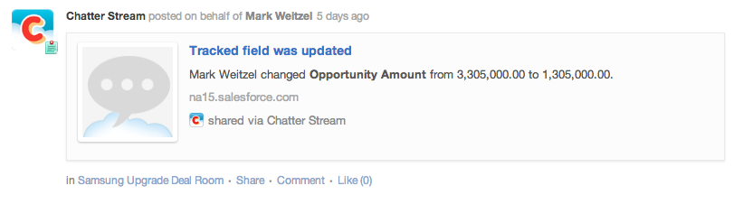

## ACTIVITY
Activities are representations of events that happened in another system. They are a very flexible structure and can represent a wide variety of concepts from backend systems, e.g. CRMs to other social systems, e.g. a Twitter feed. Here's an example of what an activity will look like when it's rendered:

# Activity Definition
Note: The items below are contained within an "activity" object, e.g. "activity":{...}, where the information with the ellipses is defined below.
<table border="0" >
  <tr>
    <th width="25%">Tile Property</th>
    <th width="65%">Description</th>
	<th width="10%">Required</th>
  </tr>
  <tr>
    <td>action</td>
    <td>The verb that represent the kind of behavior that occurred in the activity, e.g. "updated".
	<table>
	  <th>Property</th>
	  <th>Value</th>
	  <th>required</th>
	  <tr>
	    <td>name</td>
	    <td>The name of the action</td>
		<td>Yes</td>
	  </tr>
	  <tr>
	    <td>description</td>
	    <td>A textual explanation of the action.</td>
		<td>No</td>
	  </tr>
     </table>
     </td>
    <td>Yes</td>
	</tr>

	<tr>
	   <td>object</td>
	   <td>The activity object contains the information about what happened on a specific item in the target system.
		<table>
		  <th>Property</th>
		  <th>Value</th>
		  <th>required</th>
		
		  <tr>
		    <td>type</td>
		    <td>The kind of object that is the target of the activity, e.g. website, opportunity.</td>
			<td>Yes</td>
		  </tr>
		
		  <tr>
		    <td>url</td>
		    <td>A URL that represent the target object. It is recommended that this be a resolveable reference that can be used with REST.</td>
			<td>No</td>
		  </tr>
		
		  <tr>
		   <td>image</td>
		   <td>A URL that will point to a icon used to represent the activity.</td>
		   <td>No</td>
		  </tr>
	 	  <tr>
		   <td>title</td>
		   <td>The title of the activity.</td>
		   <td>No</td>
		  </tr>
		  <tr>
		    <td>description</td>
			<td>A textual explaination of the activity.</td>
			<td>No</td>
		  </tr>
		 </td>
        </table>
     </tr>

 
	<tr>
		<td>externalID</td>
		<td>A unique identifier used for cross referencing activity objects between systems.</td>
		<td>No</td>
	</tr>

</table>

#Example JSON
<pre>
	{  
	    "activity": {  
	        "action": {  
	            "name": "posted",  
	            "description": "Opportunity Updated"  
	        },  
	        "actor": {  
	            "name": "Actor Name",  
	            "email": "actor@email.com"  
	        },  
	        "object": {  
	            "type": "opportunity",  
	            "url": "http://saleforce.com/1234",  
	            "image": "http://saleforce.com/images/102x102",  
	            "title": "Big Co. Upgrade",  
	            "description": "Upgrade Opportunity for Big Co."  
	        },  
	        "externalID": "2048bbea-9254-4359-929b-784a0a5fcfff"  
	    }  
	}
</pre>

