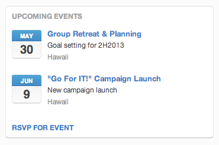

## CALENDAR
Calendars are great for showing important dates that are important to the group. This could be as simple as the date for the upcoming product launch, or as complex as the availability of the team members. Here's an example of what a calendar looks like when it's rendered:

# Calendar Definition
<table border="0" width="70%">
  <tr>
    <th width="25%">Field</th>
    <th width="65%">Tile Property</th>
	<th width="10%">Required</th>
  </tr>
  <tr>
    <td>title</td>
    <td>This is the tile of the tile. It will be displayed in the upper left hand corner of the tile's frame.</td>
	<td>Yes</td>
  </tr>
  <tr>
    <td>events</td>
    <td>An array of objects that represent the events displayed in the tile. 
	<table>
	  <th>Property</th>
	  <th>Value</th>
	  <th>required</th>
	  <tr>
	    <td>title</td>
	    <td>The title of the event.</td>
		<td>Yes</td>
	  </tr>
	  <tr>
	    <td>location</td>
	    <td>The location of the event. This is a string. Any conversion of this information is the responsibility of the back end integration server.</td>
		<td>No</td>
	  </tr>
	  <tr>
	    <td>start</td>
	    <td>The date and time that the event starts. Format is 'YYYY-MM-DDHH:00:00:000Z</td>
		<td>Yes</td>
	  </tr>
	  <tr>
	    <td>description</td>
	    <td>A short description of the event.</td>
		<td>No</td>
	  </tr>
	  <tr>
	    <td>action</td>
	    <td>An action that is specific to the event. This takes the same parameter structure as an action on the event itself, i.e. "text" and "url" fields.</td>
		<td>No</td>
	  </tr>
	</table>
   </td>
	<td>Yes</td>
  </tr>
  <tr>
    <td>action</td>
    <td>Represents the action to be taken when a user clicks on the represented link. This can be simply a URL that navigates the user to another browser window or an embedded experience. Action is a json structure consisting of two elements, text and context. 
	<table>
	  <th>Property</th>
	  <th>Value</th>
	  <th>required</th>
	  <tr>
	    <td>text</td>
	    <td>The text to display representing the action. Typically, this is shown as a link.</td>
		<td>Yes. Required within the scope of action.</td>
	  </tr>
	  <tr>
	    <td>context</td>
	    <td>Additional information that is passed to the application when the view is rendered.</td>
		<td>No</td>
	  </tr>
	</table>
   </td>
	<td>No</td>
  </tr>
  <tr>
    <td>displayName</td>
    <td>This is the text that will be displayed when the group owner adds the tile to the purposeful place.</td>
	<td>Yes</td>
  </tr>
  <tr>
    <td>description</td>
    <td>Helpful information that will be presented to the user when they are selecting the tile to be included in a template.</td>
	<td>No</td>
  </tr>
  <tr>
    <td>style</td>
    <td>This is the style of the tile. Since this is a table, the value is CALENDAR</td>
	<td>Yes</td>
  </tr>
 <tr>
    <td>icons</td>
    <td>URLs to the icons that will be used when the table is displayed. This is a json structure of three values, 16, 48, & 128. For example:
	<pre>{
"16"  : "http://openiconlibrary.sourceforge.net/gallery2/open_icon_library-full/icons/png/16x16/emblems/emblem-money.png",
"48"  : "http://openiconlibrary.sourceforge.net/gallery2/open_icon_library-full/icons/png/48x48/emblems/emblem-money.png",
"128" : "http://openiconlibrary.sourceforge.net/gallery2/open_icon_library-full/icons/png/128x128/emblems/emblem-money.png"
}
    </pre>
   </td>
	<td>No</td>
  </tr>
</table>

#Example JSON
<pre>
{"title": "Upcoming Events",  
 "events": [  
   { "title": "event title",  
     "location": "location",  
     "start": "2013-04-12T07:00:00.000Z",  
     "description": "description",  
     "action": { "url": "http://www.event.com"}  
    } ],  
     "action": {  
        "text": "allevents",  
        "url": "http://www.action.com"}  
}
</pre>

