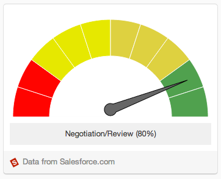

## GAUGE
Tables are a great way to show information in name/value pair format. Information from backend systems can be easily pulled and formatted in a simple json structure that provides immediate feedback to your users. Here's an example of what a table looks like when it's rendered:

# Gauge Definition
<table border="0" >
  <tr>
    <th width="25%">Tile Property</th>
    <th width="65%">Description</th>
	<th width="10%">Required</th>
  </tr>

  <tr>
    <td>title</td>
    <td>This is the tile of the tile. It will be displayed in the upper left hand corner of the tile's frame.</td>
	<td>Yes</td>
  </tr>

<tr>
    <td>sections</td>
    <td>This is the data that will render the gauge definition. For gauges, this is a json array, 'sections' that consists of structure that has label and color. For example: 
<pre>["sections": [  
   {"label": "Section 1",  
	"color": "#ff0000"},  
   {"label": "Section 2",  
    "color": "#ff8000"},
   {"label": "Section 3",  
	"color": "#ff8000"}]
	.... 
</pre>
<table>
  <th>Property</th>
  <th>Value</th>
  <th>Required</th>
  <tr>
    <td>label</td>
    <td>The text to display representing the current section of the gauge.</td>
	<td>Yes</td>
  </tr>
  <tr>
    <td>color</td>
    <td>The color, in hex, of the section.</td>
	<td>Yes</td>
  </tr>
</table>
</td>
<td>
	Yes
</td>
  </tr>

<tr>
	 <td>activeIndex</td>
	 <td>The section that the pointer should land at. For example, if there are five sections, and active index is 4, then the fourth segment will be the one indicated by the needle of the gauge.</td>
	 <td>Yes</td>	
</tr>

<tr>
	 <td>status</td>
	 <td>The text to display representing the current section of the gauge. This is displayed under the pointer bar.</td>
	 <td>No</td>	
</tr>

<tr>
    <td>action</td>
    <td>Represents the action to be taken when a user clicks on the represented link. This can be simply a URL that navigates the user to another browser window or an embedded experience. Action is a json structure consisting of two elements, text and context. 
	<table>
	  <th>Property</th>
	  <th>Value</th>
	  <th>required</th>
	  <tr>
	    <td>text</td>
	    <td>The text to display representing the action. Typically, this is shown as a link.</td>
		<td>Yes. Required within the scope of action.</td>
	  </tr>
	  <tr>
	    <td>context</td>
	    <td>Additional information that is passed to the application when the view is rendered. Note: When a context is provided, this is the indication to Jive to treat this action as an embedded experience. Providing context will result in a light box opening for the tile action. Omitting the action will simply redirect to the provided URL.</td>
		<td>No</td>
	  </tr>
	</table>
   </td>
	<td>No</td>
  </tr>

</table>

#Example JSON
<pre>
	{  
	        "message": "Simple Gauge",  
	        "sections": [  
	            {  
	                "label": "cold",  
	                "color": "#0000ff"  
	            },  
	            {  
	                "label": "warm",  
	                "color": "#ffff00  
	            },  
		        {  
		            "label": "hot",  
		            "color": "#ff0000"  
		        }
	        ],  
	        "activeIndex": 1,  
	        "status": "Fair",  
	        "action": {  
	            "text": "allevents",  
	            "url": "http://www.action.com"  
	        }  
	}
	
</pre>

