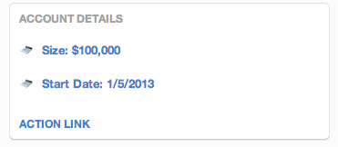

## LIST
Calendars are great for showing important dates that are important to the group. This could be as simple as the date for the upcoming product launch, or as complex as the availability of the team members. Here's an example of what a calendar looks like when it's rendered:

# List Definition
<table border="0" width="70%">
  <tr>
    <th width="25%">Field</th>
    <th width="65%">Tile Property</th>
	<th width="10%">Required</th>
  </tr>
  <tr>
    <td>title</td>
    <td>This is the tile of the tile. It will be displayed in the upper left hand corner of the tile's frame.</td>
	<td>Yes</td>
  </tr>
  <tr>
    <td>contents</td>
    <td>An array that represents the items to be displayed.
	<table>
	  <th>Property</th>
	  <th>Value</th>
	  <th>required</th>
	  <tr>
	    <td>text</td>
	    <td>The text to be displayed</td>
		<td>Yes</td>
	  </tr>
	  <tr>
	    <td>icon</td>
	    <td>An icon to be displayed to the left of the text field.</td>
		<td>No</td>
	  </tr>
	  <tr>
	    <td>linkDescription</td>
	    <td>Additional information that may be displayed, e.g. as hover text.</td>
		<td>Yes</td>
	  </tr>
	 <tr>
	    <td>action</td>
	    <td>An action for the list item. This conforms to the standard format for actions with either a context or a URL. </td>
		<td>No</td>
	  </tr>
	</table>
   </td>
	<td>Yes</td>
  </tr>
  <tr>
    <td>action</td>
    <td>Represents the action to be taken when a user clicks on the link on the bottom of the tile. This can be simply a URL that navigates the user to another browser window or an embedded experience. Action is a json structure consisting of two elements, text and context. 
	<table>
	  <th>Property</th>
	  <th>Value</th>
	  <th>required</th>
	  <tr>
	    <td>text</td>
	    <td>The text to display representing the action. Typically, this is shown as a link.</td>
		<td>Yes. Required within the scope of action.</td>
	  </tr>
	  <tr>
	    <td>context</td>
	    <td>Additional information that is passed to the application when the view is rendered.</td>
		<td>No</td>
	  </tr>
	</table>
   </td>
	<td>No</td>
  </tr>
  <tr>
    <td>displayName</td>
    <td>This is the text that will be displayed when the group owner adds the tile to the purposeful place.</td>
	<td>Yes</td>
  </tr>
  <tr>
    <td>description</td>
    <td>Helpful information that will be presented to the user when they are selecting the tile to be included in a template.</td>
	<td>No</td>
  </tr>
  <tr>
    <td>style</td>
    <td>This is the style of the tile. Since this is a list, the value is LIST</td>
	<td>Yes</td>
  </tr>
 <tr>
    <td>icons</td>
    <td>URLs to the icons that will be used when the table is displayed. This is a json structure of three values, 16, 48, & 128. For example:
	<pre>{
"16"  : "http://openiconlibrary.sourceforge.net/gallery2/open_icon_library-full/icons/png/16x16/emblems/emblem-money.png",
"48"  : "http://openiconlibrary.sourceforge.net/gallery2/open_icon_library-full/icons/png/48x48/emblems/emblem-money.png",
"128" : "http://openiconlibrary.sourceforge.net/gallery2/open_icon_library-full/icons/png/128x128/emblems/emblem-money.png"
}
    </pre>
   </td>
	<td>No</td>
  </tr>
</table>

#Example JSON
<pre>
{  
 "title": "Account Details",  
  "contents": [  
      {"text": "Size: $100,000",  
	   "icon": "http://cdn1.iconfinder.com/data/icons/free-business-desktop-icons/128/Calculator.png",  
	   "linkDescription": "Monetary value of this account.",  
	   "action": {
		  "context": {"test": "data"}  
           }  
      },  
      {"text": "Start Date: 1/5/2013",  
       "icon": "http://cdn1.iconfinder.com/data/icons/free-business-desktop-icons/128/Calculator.png",  
       "linkDescription": "Date when this account was opened.",  
       "action": {  
          "context": {"test": "data"}  
          }  
      }  
  ],  
  "style": "LIST",
  "action": {  
      "text": "Action Link",  
      "context": {  
          "test": "data"  
      }  
  }  
}
</pre>

