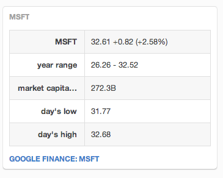

## TABLE
Tables are a great way to show information in name/value pair format. Information from backend systems can be easily pulled and formatted in a simple json structure that provides immediate feedback to your users. Here's an example of what a table looks like when it's rendered:

# Table Definition
<table border="0" width="70%">
  <tr>
    <th width="25%">Field</th>
    <th width="65%">Tile Property</th>
	<th width="10%">Required</th>
  </tr>
  <tr>
    <td>title</td>
    <td>This is the tile of the tile. It will be displayed in the upper left hand corner of the tile's frame.</td>
	<td>Yes</td>
  </tr>
  <tr>
    <td>contents</td>
    <td>This is the data that will be rendered in the tile. For tables, this is a json array that consists of name, value, and URL. For example: 
<pre>[{"name": "Name",
"value": "Edge Communications",  
"url": "https://na15.salesforce.com/001i0000004AqTD"},
{"name": "Industry",  
"value": "Electronics"}]</pre>
When using a table, name and value are required, URL is optional.
	</td>
	<td>Yes</td>
  </tr>
  <tr>
    <td>action</td>
    <td>Represents the action to be taken when a user clicks on the represented link. This can be simply a URL that navigates the user to another browser window or an embedded experience. Action is a json structure consisting of two elements, text and context. 
	<table>
	  <th>Property</th>
	  <th>Value</th>
	  <th>required</th>
	  <tr>
	    <td>text</td>
	    <td>The text to display representing the action. Typically, this is shown as a link.</td>
		<td>Yes. Required within the scope of action.</td>
	  </tr>
	  <tr>
	    <td>context</td>
	    <td>Additional information that is passed to the application when the view is rendered. Note: When a context is provided, this is the indication to Jive to treat this action as an embedded experience. Providing context will result in a light box opening for the tile action. Omitting the action will simply redirect to the provided URL.</td>
		<td>No</td>
	  </tr>
	</table>
   </td>
	<td>No</td>
  </tr>
  <tr>
    <td>displayName</td>
    <td>This is the text that will be displayed when the group owner adds the tile to the purposeful place.</td>
	<td>Yes</td>
  </tr>
  <tr>
    <td>description</td>
    <td>Helpful information that will be presented to the user when they are selecting the tile to be included in a template.</td>
	<td>No</td>
  </tr>
  <tr>
    <td>style</td>
    <td>This is the style of the tile. Since this is a table, the value is TABLE</td>
	<td>Yes</td>
  </tr>
 <tr>
    <td>icons</td>
    <td>URLs to the icons that will be used when the table is displayed. This is a json structure of three values, 16, 48, & 128. For example:
	<pre>{
"16"  : "http://openiconlibrary.sourceforge.net/gallery2/open_icon_library-full/icons/png/16x16/emblems/emblem-money.png",
"48"  : "http://openiconlibrary.sourceforge.net/gallery2/open_icon_library-full/icons/png/48x48/emblems/emblem-money.png",
"128" : "http://openiconlibrary.sourceforge.net/gallery2/open_icon_library-full/icons/png/128x128/emblems/emblem-money.png"
}
    </pre>
   </td>
	<td>No</td>
  </tr>
</table>

#Example JSON
<pre>
	{
	    "sampleData" : {
	        "title" : "Stock Price Example",
	        "contents" : [
	            { "name" : "JIVE", "value" : "--" }
	        ],
	        "action" : {
	            "text" : "Google Finance: JIVE",
	            "url" : "https://www.google.com/finance?q=JIVE"
	        }
	    },
	    "displayName" : "Stock Price (example-stock-tile)",
	    "name" : "example-stock-tile",
	    "description" : "Displays live stock prices",
	    "style" : "TABLE",
	    "icons" : {
	        "16"  : "http://openiconlibrary.sourceforge.net/gallery2/open_icon_library-full/icons/png/16x16/emblems/emblem-money.png",
	        "48"  : "http://openiconlibrary.sourceforge.net/gallery2/open_icon_library-full/icons/png/48x48/emblems/emblem-money.png",
	        "128" : "http://openiconlibrary.sourceforge.net/gallery2/open_icon_library-full/icons/png/128x128/emblems/emblem-money.png"
	    }
	}
	
</pre>

